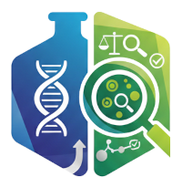

# QualiTrace

<p align="center">
  
  <br>
  <b>Pilotage de la conformité et traçabilité des flux industriels.</b>
</p>

<p align="center">
  
  
  
  
  <br>
  
  
</p>

---

## 📝 Présentation du projet
**QualiTrace** est une solution légère de **LIMS** (Laboratory Information Management System) et de **MES** (Manufacturing Execution System) dédiée aux industries critiques (Pharmaceutique, Cosmétique).

Le projet vise à garantir l'intégrité des données (**ALCOA+**) et la traçabilité totale du cycle de vie des produits, de la réception des matières premières à la libération des produits finis.

### 🌟 Fonctionnalités clés (MVP)
- **Gestion des Référentiels :** Articles, Spécifications, Fournisseurs et Utilisateurs.
- **Traçabilité des Lots :** Attribution de n° de lots internes, gestion des dates de péremption et statuts (Quarantaine, Libéré, Rejeté).
- **Laboratoire & Qualité :** Saisie des résultats d'analyse avec validation automatique selon les spécifications.
- **Audit Trail :** Journalisation immuable de toutes les actions critiques (Conformité 21 CFR Part 11).

---

## 🛠 Stack Technique
* **Backend :** Java 21, Spring Boot 4.0, Spring Data JPA.
* **API :** RESTful avec support **HATEOAS** pour une navigation hypermédia.
* **Documentation :** OpenAPI / Swagger UI.
* **Base de données :** PostgreSQL (Persistence) & Redis (Cache/Session).
* **Build Tool :** Gradle (Kotlin DSL).
* **DevOps :** Docker & Docker Compose.

---

## 🚀 Démarrage rapide

### Pré-requis
* Docker & Docker Compose
* JDK 21 (pour le développement local)


### Récupération du projet

```bash
# Cloner le projet
git clone https://github.com/neeftarah/qualitrace.git
```

### Lancement avec Docker
```bash
# Lancer les services (Base de données, etc.)
docker-compose up -d

# Lancer l'application
./gradlew bootRun
```
