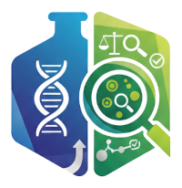

# QualiTrace

<p align="center">
    
    <br>
    <b>Pilotage de la conformité et traçabilité des flux industriels.</b>
</p>

<p align="center">
    
    
    
    
    
    
    <br>
    
    
    
    <br>
    <br>
    
    <br>
    
    
    
    
    
</p>

---

## 📝 Présentation du projet
**QualiTrace** est une solution légère de **LIMS** (Laboratory Information Management System) et de **MES** (Manufacturing Execution System) dédiée aux industries critiques (Pharmaceutique, Cosmétique).

Le projet vise à garantir l'intégrité des données (**ALCOA+**) et la traçabilité totale du cycle de vie des produits, de la réception des matières premières à la libération des produits finis.

### 🌟 Fonctionnalités clés (MVP)
- **Gestion des Référentiels :** Articles, Spécifications, Fournisseurs et Utilisateurs.
- **Traçabilité des Lots :** Attribution de n° de lots internes, gestion des dates de péremption et statuts (Quarantaine, Libéré, Rejeté).
- **Laboratoire & Qualité :** Saisie des résultats d'analyse avec validation automatique selon les spécifications.
- **Audit Trail :** Journalisation immuable de toutes les actions critiques (Conformité 21 CFR Part 11).

---

## 🛠 Stack Technique
* **Backend :** Java 25, Spring Boot 4.0, Spring Data JPA.
* **API :** RESTful avec support **HATEOAS** pour une navigation hypermédia.
* **Documentation :** OpenAPI / Swagger UI.
* **Base de données :** PostgreSQL (Persistence) & Redis (Cache/Session).
* **Frontend :** Angular 21, PrimeNG avec template de base Sakai.
* **Build Tool :** Gradle (Kotlin DSL).
* **DevOps :** Docker & Docker Compose.

---

## 🚀 Démarrage rapide

### Pré-requis
* Docker & Docker Compose
* JDK 25 (pour le développement local)


### Récupération du projet

```bash
git clone https://github.com/neeftarah/qualitrace.git
```

### Lancement des services Docker (Base de données, etc.)

```bash
docker-compose up -d
```

### Build du projet avec live reload (Spring Boot DevTools)
```bash
.\backend\gradlew.bat -p backend build --continuous -x test --write-locks
```

### Lancement de l'application
```bash
.\backend\gradlew.bat -p backend bootRun
```

## Accéder à l'application

### URLs
- **Frontend :** [http://localhost:8080](http://localhost:8080)
- **API Swagger :** [http://localhost:8080/swagger-ui/index.html](http://localhost:8080/swagger-ui/index.html)

### [OPTIONNEL] Peupler la base de données avec des données de test
```bash
.\backend\gradlew.bat -p backend seedDb
```

### Comptes par défaut des utilisateurs de test
_(après exécution de la tâche `seedDb`) :_

| Login    | Mot de passe | Rôle           |
|----------|--------------|----------------|
| root     | root         | Tous les rôles |
| admin    | admin        | ADMIN          |
| supply   | supply       | SUPPLY         |
| aq       | aq           | AQ             |
| cq       | cq           | CQ             |
| planning | planning     | PLANNING       |
| prod     | prod         | PRODUCTION     |