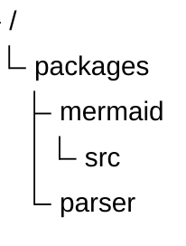

📂 Structure DDD / CQRS Idéale
===============================

```
╔═╦═ domain : (Le Cœur métier - Objets "Entity" Arrington)
║ ╠═══ domain/model : Les Entités métiers pures (ex: Lot, Saisie) et Value Objects. Contiennent la logique métier.
║ ╠═══ domain/repository/ : Les interfaces de contrats (ex: LotRepository). (Descendant des "LifeCycle" Arrington).
║ ╠═══ domain/service/ : Services métiers inter-entités, à utiliser uniquement si une logique implique plusieurs entités et ne peut pas tenir dans une seule.
║ ╚═══ domain/exception/ : Les exceptions "métier" (ex: UserEmailAlreadyTakenException).
║
╠═╦═ application : (L'Orchestrateur - Objets "Control" Arrington)
║ ╠═══ application/service : Les Services Applicatifs (ex: LotApplicationService). Un service par grand cas d'utilisation métier. Il orchestre les entités du domaine.
║ ╠═══ application/dto : Les structures de données exposées à l'IHM Angular.
║ ╚═══ application/mapper : Les interfaces de conversion (ex: Convertir Domaine -> DTO).
║
╚═╦═ infrastructure : (Les Détails Techniques & les "Adaptateurs")
  ╠═══ infrastructure/api : Les points d'entrée des API REST (Les @RestController Spring Boot)
  ╠═╦═ infrastructure/persistence/ : (La persistance - Implémentation des "LifeCycle" Arrington)
  ║ ╠═══ infrastructure/persistence/entities : Les Entités JPA (ex: LotEntity, UserEntity) qui représentent les tables de la base de données.
  ║ ╠═══infrastructure/persistence/repositories : Les implémentations concrètes des interfaces du domaine
  ║ ╚═══infrastructure/persistence/db : Les Listeners JPA pour l'Audit Trail.
  ╚═══ infrastructure/config : La configuration de l'application (ex: Spring Beans, DataSource, etc).
```



